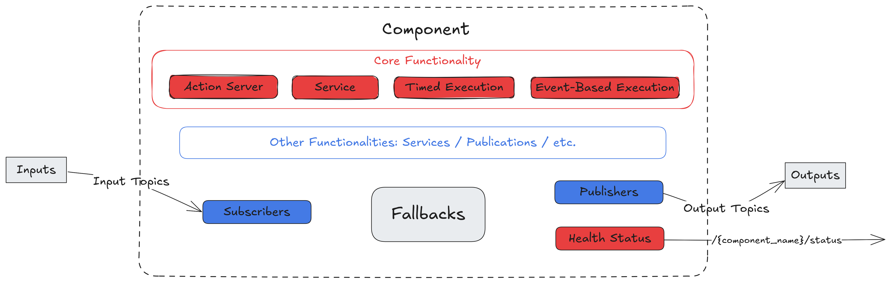

<picture>
  <source media="(prefers-color-scheme: dark)" srcset="_static/SUGARCOAT_DARK.png">
  <source media="(prefers-color-scheme: light)" srcset="_static/SUGARCOAT_LIGHT.png">
  
</picture>

<br/>

🇨🇳 [简体中文](README.zh.md) | 🇯🇵 [日本語](README.ja.md)

## イベント駆動型 ROS2 システムのためのオーケストレーション層

**Sugarcoat** は、断片化された _ROS2_ 開発を統一されたワークフローに置き換えるメタフレームワークです。堅牢なコンポーネントを構築し、それらを自己修復可能な統合されたシステムへと編成（オーケストレーション）するための高レベルな API を提供します。

冗長なボイラープレートや静的な launch ファイルを、宣言型の **イベント駆動 API (Event-Driven API)** に置き換えることで、モダンな Python の優雅さをもって複雑なロボットの振る舞いをオーケストレーションすることができます。

## なぜ Sugarcoat なのか？ オーケストレーションのギャップを埋める

標準的な ROS2 エコシステムでは、開発者は個々の「レンガ」（ノード）を作成するための強力なツールを与えられていますが、「建物」（システム）を作成するためのツールはほとんどありません。ロボットシステムの規模が拡大するにつれて、低レベルのドライバと高レベルのミッション計画の間の空白である「オーケストレーションのギャップ」に必然的に直面します。

- **標準の ROS2**: 「マネージャーノード」問題を引き起こします。ノードを調整するために、開発者はコールバック、タイマー、ハードコードされた論理の「スパゲッティ」状態になりやすいマネージャーノードを作成することになり、テストが困難で障害が発生しやすくなります。
- **ビヘイビアツリー (例: Nav2)**: ロジックを順次処理するためのシーケンシャルなポーリングメカニズム（「ティック」）に依存しています。これらは遅延が発生しやすく、複雑なアクション中にシステムが反応する能力を阻害する可能性があり、グローバルスコープの安全トリガー（ユニバーサルキルスイッチなど）の実装を著しく困難にします。

**Sugarcoat の解決策**: Sugarcoat は、命令型のイベント駆動型中間層を提供します。リストを「ティック」で進むことのない**並列イベントエンジン (Parallel Event Engine)** で動作し、システム全体を一度に監視することで、マイクロ秒単位の即時反応時間を持つ真の分散型自動化を提供します。

## 主な機能とコアとなる柱

| 機能                                                       | 説明                                                                                                                                                                                                                                                                                  |
| :--------------------------------------------------------- | :------------------------------------------------------------------------------------------------------------------------------------------------------------------------------------------------------------------------------------------------------------------------------------ |
| **スマートコンポーネント (Smart Components)**              | すべてのコンポーネントは、標準で管理されたライフサイクルノード（Configure、Activate、Deactivate）です。`attrs` による型安全な設定と、入出力のための宣言的な自動ワイヤリングを備えています。                                                                                           |
| **アクティブレジリエンス (Active Resilience)**             | <br> ROS2 ノードに組み込まれた「免疫システム」。コンポーネントは自身の**健康状態 (Health Status)**（アルゴリズム、コンポーネント、またはシステムの障害）をアクティブに報告し、クラッシュすることなく自己修復するための分散型**フォールバック (Fallbacks)** を自動的にトリガーします。 |
| **イベント駆動型の振る舞い (Event-Driven Behavior)**       | グローバルな**イベント (Events)**（例: `Event(battery < 10.0)`）と**アクション (Actions)** を、純粋で読みやすい Python で定義します。これらはトリガーとして機能し、ROS2 トピックをネイティブに監視して、現在のシステム状態に関係なく即座に実行されます。                              |
| **集中型オーケストレーション (Centralized Orchestration)** | 強力な**ランチャー (Launcher)** が `ros2 launch` の Pythonic な代替として機能します。マルチスレッドまたはマルチプロセス実行をサポートし、実行時にコンポーネントのライフサイクルを能動的に監視します。                                                                                 |
| **ユニバーサルアプリケーション (Universal Applications)**  | **ロボットプラグイン (Robot Plugins)** が翻訳層として機能します。これにより、コードを変更することなくあらゆるロボットで動作する、汎用的で移植可能な自動化ロジック（レシピ）を作成できます。                                                                                           |
| **動的 Web UI (Dynamic Web UI)**                           | すべてのトピック、パラメータ、イベントに対応する、完全に機能する Web フロントエンドを瞬時に自動生成します。                                                                                                                                                                           |

## Sugarcoat で構築されたパッケージ

- [**Kompass**](https://automatikarobotics.com/kompass/): 使いやすく直感的な Python API を使用して、堅牢で包括的なイベント駆動型ナビゲーションスタックを構築するためのフレームワークです。
- [**EmbodiedAgents**](https://automatika-robotics.github.io/embodied-agents/): 考え、理解し、行動できるインタラクティブな身体的エージェント (Embodied Agents) を作成するためのフル装備のフレームワークです。

## はじめに

- Sugarcoat の[**設計コンセプト**](https://automatika-robotics.github.io/sugarcoat/design/index.html)について詳しく学ぶ
- Sugarcoat を使用して[**独自の ROS2 パッケージを作成する**](https://automatika-robotics.github.io/sugarcoat/use.html)方法を学ぶ
- **ロボットプラグイン**を使用して、[**自動化レシピを異なるハードウェア間で移植する**](https://automatika-robotics.github.io/sugarcoat/features/robot_plugins.html)
- リアルタイムのシステム可視化と制御のための[**動的 Web UI**](https://automatika-robotics.github.io/sugarcoat/features/web_ui.html)を探索する

## Sugarcoat の仕組み

Sugarcoat のコアは、集中型オーケストレーションと反応的な自律性をロボットにもたらすことを中心に展開しています。

### 1. コンポーネント (スマートな実行)

`Component`（コンポーネント）は、標準の ROS2 ノードに代わるメインの実行ユニットです。独自の設定を検証し、トピックを宣言的に自動接続し、ライフサイクルをネイティブに管理します。

<p align="center">
<picture align="center">
  <source media="(prefers-color-scheme: dark)" srcset="_static/images/diagrams/component_dark.png">
  <source media="(prefers-color-scheme: light)" srcset="_static/images/diagrams/component_light.png">
  
</picture>
</p>

### 2. イベントとアクション (反応的な中間層)

純粋な Python 式を使用して動的な振る舞いを定義します。イベントは並列に継続的にトピックを監視し、コンポーネントの実行状態からは完全に独立しています。

```python
from ros_sugar.core import Event, Action

# 並列で監視されるグローバルイベント。ゼロポーリング遅延で即座に実行されます。
collision_risk = Event(sensor.msg.min_dist < 0.5)

# システム全体のアクションを即座にトリガーします。
launcher.add_pkg(
    components=[...],
    events_actions={collision_risk: Action(stop_motors)}
)
```

### 3. ランチャー (オーケストレーション)

定義されたコンポーネント、イベント、アクションを受け取り、システムを実行します。ランチャー（Launcher）は健康状態を能動的に追跡し、マルチスレッドまたはマルチプロセス実行をクリーンにオーケストレーションします。

<p align="center">
<picture>
<source media="(prefers-color-scheme: dark)" srcset="_static/images/diagrams/multi_process_dark.png">
<source media="(prefers-color-scheme: light)" srcset="_static/images/diagrams/multi_process_light.png">

</picture>
</p>

## Sugarcoat レシピのための動的 Web UI

**動的 Web UI (Dynamic Web UI)** 機能は、システムの可視性と制御を次のレベルへと引き上げます。**[FastHTML](https://www.fastht.ml/)** と **[MonsterUI](https://monsterui.answer.ai/)** で構築されており、あらゆる Sugarcoat レシピの完全に動的で拡張可能な Web インターフェースを自動生成するように設計されており、手動でのフロントエンド開発の必要性を完全に排除します。

この機能により、複雑なマルチノード ROS2 システムが、監視および設定可能な Web アプリケーションへと瞬時に変換されます。

### 自動 UI 生成のアクション

さまざまな種類の Sugarcoat レシピに対して、Web UI がいかに簡単にインターフェースを生成するかをご覧ください。

- **例 1: 一般的な Q&A MLLM レシピ**
  **[EmbodiedAgents](https://automatika-robotics.github.io/embodied-agents/)** の MLLM エージェントレシピ用に自動生成された完全に機能するインターフェース。設定コントロールと、ロボットとのリアルタイムテキスト I/O を自動的に提供します。

<p align="center">
<picture align="center">

</picture>
</p>

- **例 2: ポイントナビゲーションレシピ**
  **[Kompass](https://automatikarobotics.com/kompass/)** のポイントナビゲーションシステム用に自動生成された UI の例。この UI は自動的にマップデータをレンダリングし、ロボットにナビゲーション目標を送信します。

<p align="center">
<picture align="center">

</picture>
</p>

### 主な機能

- **自動設定 UI**: レシピで使用されるすべての**コンポーネント**の設定を構成するためのインターフェースがオンザフライで生成されます。
- **自動 I/O 可視化**: UI の**入力**と**出力**用のフロントエンドコントロールとデータ可視化が自動的に作成されます。
- **WebSocket ベースのストリーミング**: **テキスト、画像、音声**メッセージをストリーミングするための双方向・低遅延の通信機能を備えています。
- **レスポンシブなレイアウト**: 入出力要素は、明確で適応性のあるグリッドレイアウトで表示されます。
- **拡張可能な設計**: 拡張機能を通じて、新しいメッセージタイプやカスタム可視化のサポートを簡単に追加できます。

## インストール

Sugarcoat は **Humble** 以降の ROS バージョンで利用可能です。

### パッケージマネージャーを使用する (推奨)

例えば、Ubuntu の場合：

`sudo apt install ros-$ROS_DISTRO-automatika-ros-sugar`

または、[リリースページ](https://github.com/automatika-robotics/sugarcoat/releases)から特定の deb パッケージをインストールすることもできます：

`sudo dpkg -i ros-$ROS_DISTRO-automatica-ros-sugar_$version$DISTRO_$ARCHITECTURE.deb`

> **注:** パッケージマネージャーの `attrs` のバージョンが 23.2 より古い場合は、pip 経由で更新する必要がある場合があります：
> `pip install 'attrs>=23.2.0'`

### ソースからのビルド

```shell
mkdir -p ros-sugar-ws/src
cd ros-sugar-ws/src
git clone [https://github.com/automatika-robotics/sugarcoat](https://github.com/automatika-robotics/sugarcoat) && cd ..

# 依存関係のインストール (attrs>=23.2.0 が含まれていることを確認)
pip install numpy opencv-python-headless 'attrs>=23.2.0' jinja2 msgpack msgpack-numpy setproctitle pyyaml toml

colcon build
source install/setup.bash
```

## 著作権

このディストリビューションのコードの著作権は、明記されていない限り、Automatika Robotics (c) 2024 に帰属します。

Sugarcoat は MIT ライセンスの下で利用可能です。詳細は [LICENSE](https://www.google.com/search?q=LICENSE) ファイルで確認できます。

## 貢献

Sugarcoat は、[Automatika Robotics](https://automatikarobotics.com/) と [Inria](https://inria.fr/) の共同開発によって誕生しました。コミュニティからの貢献を大いに歓迎します。

## 謝辞

**動的 Web UI** は、2つの素晴らしいオープンソースプロジェクトによって支えられています。以下のプロジェクトにおける Answers.ai の取り組みに深く感謝します：

- **[FastHTML](https://www.fastht.ml/)**: 動的な Web インターフェースの自動生成を可能にする HTMX ベースのフレームワーク。
- **[MonsterUI](https://monsterui.answer.ai/)**: インターフェースを直感的にするスタイリッシュな UI コンポーネント。
