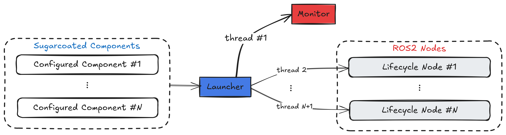

  
  

 

# Sugarcoat 🍬

Sugarcoat 🍬 provides a whole lot of syntactic sugar for creating multi-node ROS2 event-driven systems and management using an intuitive Python API.

- Discover the [**advantages of using Sugarcoat**](why.md) for creating ROS2 packages ⚡
- Learn more about the [**design concepts**](design/concepts_overview.md) in Sugarcoat
- Learn how to [**create your own ROS2 package**](advanced/use.md) using Sugarcoat

## Overview

_Sugarcoat_ is built for ROS2 developers who want to create robust, event-driven systems with multiple nodes that are easy to use and can be configured and started with an intuitive python API. It provides primitives for writing ROS nodes and events/actions which can start/stop/modify the nodes, in the spirit of _event driven software standard_. Sugarcoat is also a replacement for the ROS Launch API.

A [Component](./design/component.md) is the main execution unit in Sugarcoat, each component is configured with [Inputs/Outputs](./design/topics.md) and [Fallback](./design/fallbacks.md) behaviors. Additionally, each component updates its own [Health Status](./design/status.md), to keep track of the well/mal functioning of the component. Components can be handled and reconfigured dynamically at runtime using [Events](./design/events.md) and [Actions](./design/actions.md). Events, Actions and Components are passed to the [Launcher](./design/launcher.md) which runs the set of components as using multi-threaded or multi-process execution. The Launcher also uses an internal [Monitor](./design/monitor.md) to keep track of the components and monitor events.

:::{figure-md} fig-component

Component Structure
:::

:::{figure-md} fig-multi-threaded

Multi-threaded execution
:::

:::{figure-md} fig-multi-processed

Multi-process execution
:::

## Packages created using Sugarcoat

- [**Kompass**](https://automatikarobotics.com/kompass/): a framework for building robust and comprehensive event-driven navigation stacks using an easy-to-use and intuitive Python API
- [**ROS Agents**](https://automatika-robotics.github.io/ros-agents/): a fully-loaded framework for creating interactive embodied agents that can understand, remember, and act upon contextual information from their environment.
